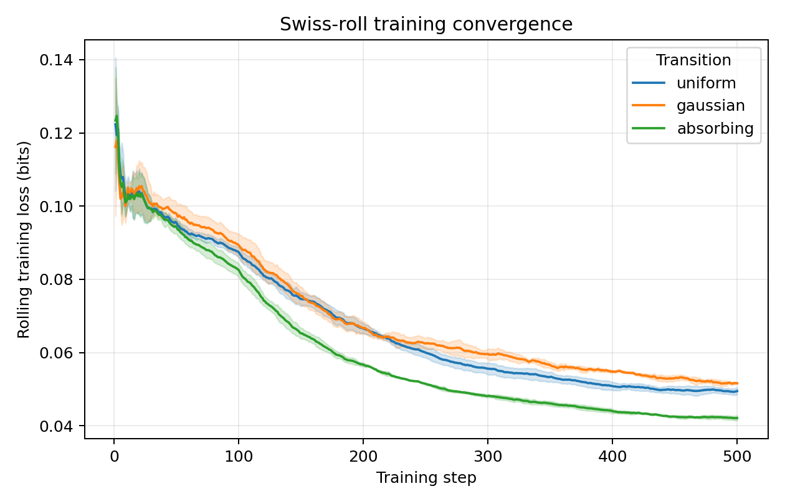
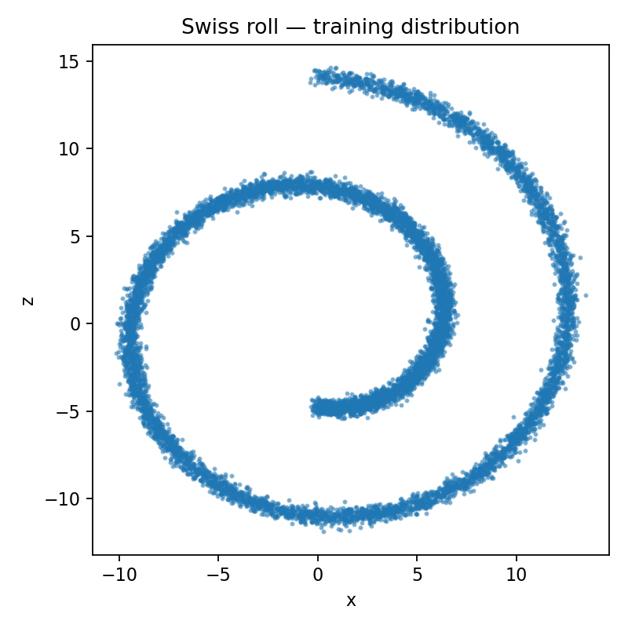
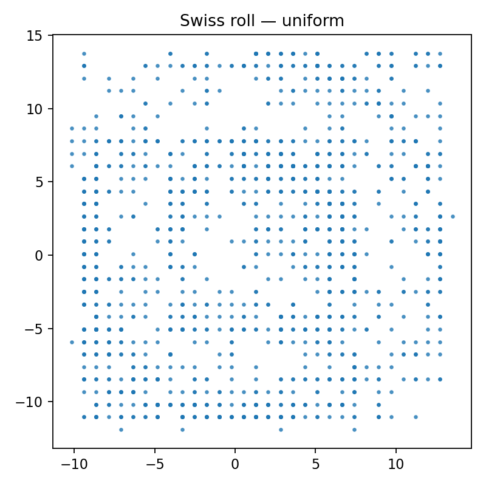
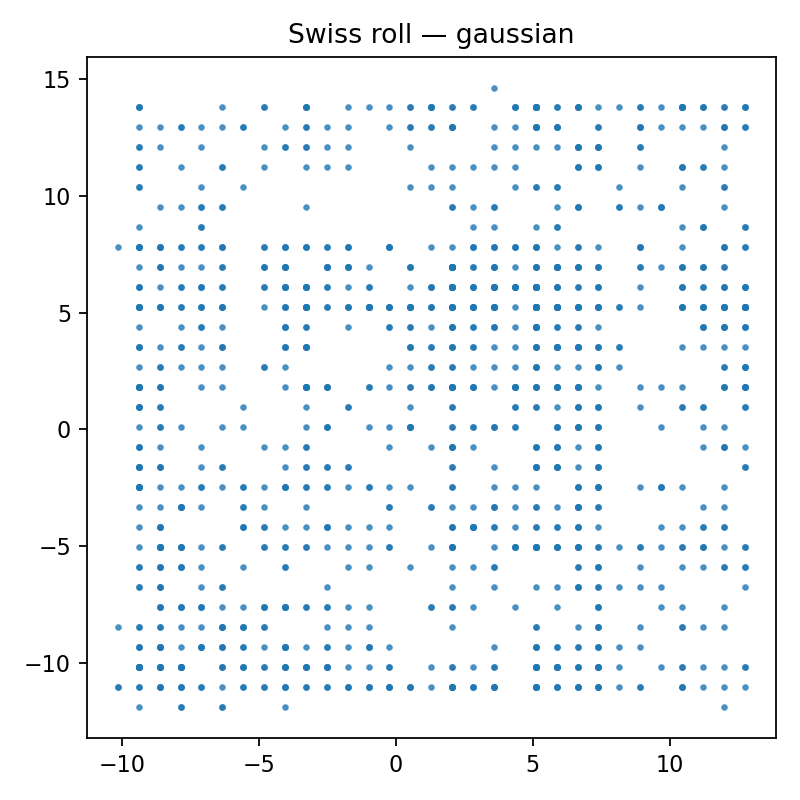
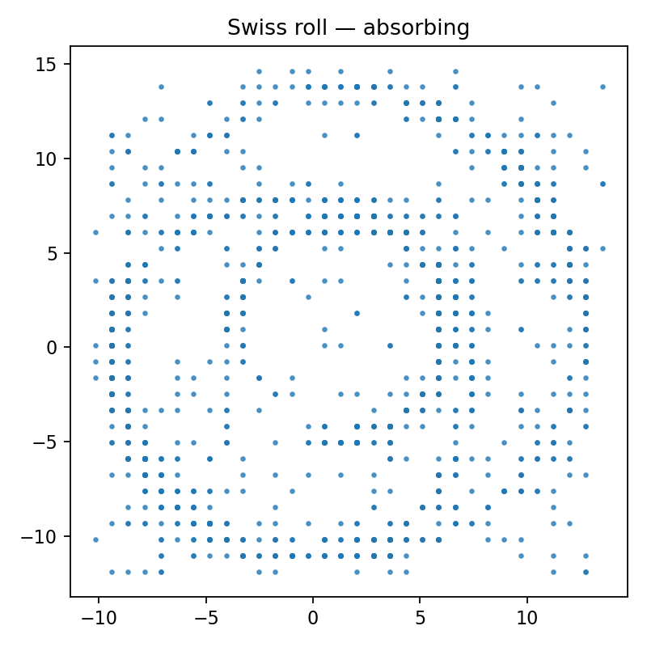
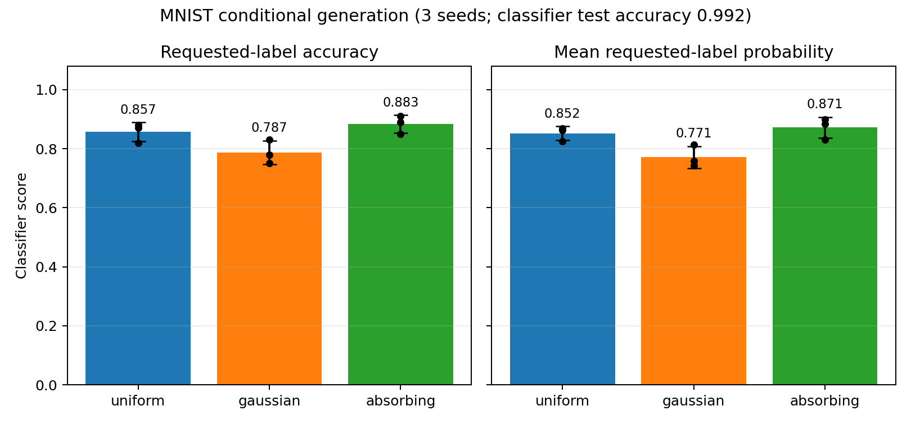

#  Discrete Denoising Diffusion Probabilistic Models (D3PM)

## Fair 2-D Swiss-roll transition comparison

Three forward kernels are compared: `uniform`, `gaussian`, and `absorbing`.
For this task, comparing only the training loss or using the same raw beta
schedule is not valid: the kernels mix at different rates, so their terminal
forward distributions can be at very different distances from the prior used
by the sampler. The experiment script therefore calibrates the endpoint of a
linear beta schedule separately for each kernel until the worst-row terminal
total-variation (TV) distance to its own sampling prior is `0.005`.

### Protocol

- Data: 10,000 noisy 2-D Swiss-roll points, quantized independently per axis to
  32 categorical states. The roll parameter is split into three equal bins and
  used as the conditional label.
- Model and budget: conditional DiT (`hidden_size=64`, depth 3, 4 heads), 100
  diffusion steps, batch size 256, AdamW with learning rate `3e-4`, and 500
  update steps per run.
- Fairness controls: identical model, optimizer, data, training budget,
  diffusion length, categorical resolution, and seeds (`0, 1, 2`) across
  transitions. Only the calibrated forward kernel changes.
- Metric: class-conditional 2-D sliced Wasserstein-1 distance (SWD; 128 random
  projections, 500 generated samples per class) measured in original Swiss-roll
  coordinates. Lower is better. The reported uncertainty is the sample standard
  deviation across the three training seeds.

Run the comparison with:

```bash
python experiments/run_transition_comparison.py \
  --dataset swiss --seeds 0 1 2 --steps 500 --batch-size 256 \
  --timesteps 100 --K 32 --hidden-size 64 --depth 3 --heads 4 \
  --samples-per-class 500
```

### Results

| Transition | Calibrated beta endpoint | Terminal TV | Final train loss (bits) | Conditional SWD ↓ |
| --- | ---: | ---: | ---: | ---: |
| uniform | 0.10159 | 0.00500 | 0.0495 ± 0.0011 | 2.939 ± 0.086 |
| gaussian | 0.17083 | 0.00500 | 0.0516 ± 0.0002 | 3.101 ± 0.060 |
| absorbing | 0.10217 | 0.00500 | **0.0421 ± 0.0008** | **2.641 ± 0.055** |

Under this small, fixed-budget benchmark, the absorbing kernel has the best
conditional sample distribution: its mean SWD is about 10% lower than uniform
and 15% lower than gaussian. This is a result for this discrete quantization,
model capacity, schedule target, and training budget—not a general ranking of
transition kernels. In particular, longer training, additional seeds, a second
sample-quality metric, and a larger DiT should be used before extrapolating to
image generation.

### Training convergence



The figure uses the TensorBoard `train/loss_bits_window` series. All three
curves decrease smoothly over the full 500 updates and their seed-to-seed bands
remain narrow, so there is no sign of divergence or an unstable transition
schedule. They have not fully flattened by step 500—especially uniform and
gaussian—so this is a compute-limited comparison rather than a fully converged
one. Absorbing has the lowest training loss throughout the later part of the
run, but SWD remains the primary cross-transition quality metric.

Regenerate the figure from the event files with:

```bash
python experiments/plot_swiss_loss.py \
  --logdir artifacts/tensorboard/swiss_fair \
  --output docs/images/swiss-roll-training-loss.png
```

### Visual comparison

The target is a continuous spiral, whereas generated points lie on a `32 × 32`
grid because D3PM models independently quantized `x` and `z` coordinates. The
plots below use the same seed (`0`) and show the combined samples from all three
conditional labels. A good result should retain the central opening and both
spiral arms, rather than filling the bounding box uniformly.

<p align="center">
  
</p>
<p align="center"><em>Target distribution</em></p>

<p align="center">
  
  
  
</p>
<p align="center"><em>uniform (left), gaussian (centre), absorbing (right)</em></p>

At this budget all methods capture some coarse geometry but are still visibly
more diffuse than the target. The absorbing kernel preserves the spiral opening
most consistently, matching its lower SWD; this visual observation is only
supporting evidence, while the table above is the quantitative comparison.

Raw per-seed results and generated samples are stored under
`artifacts/swiss_fair/seed{0,1,2}/swiss/`. TensorBoard logs are under
`artifacts/tensorboard/swiss_fair/`.

## MNIST conditional-generation evaluation

MNIST samples should not be ranked by D3PM training loss alone. Keep training
jobs short and robust by generating only a small visual grid at their end:

```bash
python -m experiments.run_transition_comparison \
  --dataset mnist --device cuda --seeds 0 1 2 --steps 30000 \
  --batch-size 64 --timesteps 100 --K 32 \
  --hidden-size 96 --depth 4 --heads 4 \
  --samples-per-class 10 --sample-batch-size 32 --checkpoint-every 0
```

The final checkpoint can then be sampled independently at the larger evaluation
count, so a long sampling phase cannot discard an already trained model:

```bash
python -m experiments.sample_mnist_checkpoint \
  --checkpoint artifacts/checkpoints/mnist/uniform_seed0.pt \
  --device cuda --samples-per-class 1000 --sample-batch-size 32 \
  --cfg-scale 1.5 \
  --output-dir artifacts/mnist_comparison/mnist
```

This writes a `.pt` file containing quantized samples, requested digit labels,
`K`, transition name, and seed. Train a reference classifier on MNIST quantized
to that same `K`, then evaluate whether generated images are recognized as their
requested labels:

The DiT is trained with 10% class-label dropout and supports classifier-free
guidance (CFG) during sampling. `--cfg-scale 1.0` reproduces ordinary conditional
sampling, `0.0` uses the null-label prediction, and values above one strengthen
label adherence at the cost of diversity and roughly twice the denoiser compute.
Evaluate a small sweep such as `1.0`, `1.5`, and `2.0` with the classifier rather
than assuming one scale is optimal.

```bash
python experiments/evaluate_mnist_classifier.py \
  --device cuda --K 32 \
  --sample-files artifacts/mnist_comparison/mnist/uniform_seed0.pt \
                 artifacts/mnist_comparison/mnist/gaussian_seed0.pt \
                 artifacts/mnist_comparison/mnist/absorbing_seed0.pt \
  --output artifacts/mnist_comparison/classifier_eval.json
```

On its first invocation the evaluator trains and saves a classifier checkpoint.
It reports the classifier's test accuracy (verify it is high before trusting the
metric), overall requested-label accuracy, mean probability assigned to the
requested label, and the same two values for every digit class. The JSON retains
per-class results; the adjacent CSV provides one aggregate row per sample file.

### Completed 30k-step comparison

The following baseline used `K=32`, `T=100`, the same conditional DiT
(`hidden_size=96`, depth 4, 4 heads), batch size 64, 30,000 updates, and three
training seeds. Each transition used a separately calibrated linear schedule
with terminal TV distance `0.005`; only the forward transition differs. The
reported samples use ordinary conditional sampling (`cfg_scale=1.0`).

The reference classifier was trained on MNIST quantized with the same `K=32`
and reached 99.2% test accuracy. For a size-matched comparison, every run was
evaluated on 10 requested samples per digit (100 per seed). Error bars are the
sample standard deviation over three training seeds.

| Transition | Beta endpoint | Final train loss (bits) ↓ | Requested-label accuracy ↑ | Mean requested-label probability ↑ |
| --- | ---: | ---: | ---: | ---: |
| uniform | 0.10159 | 0.00721 ± 0.00024 | 0.857 ± 0.032 | 0.852 ± 0.023 |
| gaussian | 0.17083 | 0.00738 ± 0.00039 | 0.787 ± 0.040 | 0.771 ± 0.037 |
| absorbing | 0.10217 | **0.00642 ± 0.00009** | **0.883 ± 0.031** | **0.871 ± 0.036** |



For this fixed-budget benchmark, the absorbing transition is the strongest:
it has the lowest training loss and the best conditional adherence. Its mean
requested-label accuracy is 2.7 percentage points above uniform and 9.7 points
above gaussian. Uniform is consistently second, while gaussian needs a larger
beta endpoint to reach the same terminal-mixing target and performs worst here.

This is a comparison of conditional recognizability, not a complete image-quality
claim: the classifier metric does not directly measure diversity, realism, or
intra-class coverage. The 100 samples per seed also make this a compact
evaluation; a stronger report should add more evaluation samples, FID/KID-like
feature distances, and a CFG-scale sweep. The raw evaluation data is in
`artifacts/transition_comparison/mnist/classifier_eval_equal_n100.json`, and the
plot can be regenerated with `experiments/plot_mnist_classifier_results.py`.


## References

https://github.com/dirmeier/d3pm

https://github.com/ljh0v0/D3PM-Pytorch
